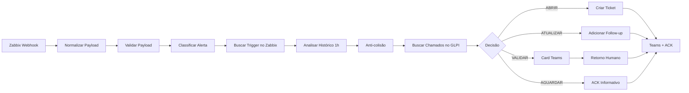

# W01 Principal — Automação NOC com Zabbix, n8n, GLPI e Microsoft Teams

> Showcase técnico de uma automação NOC criada em n8n para correlacionar alertas do Zabbix, tickets GLPI e notificações no Microsoft Teams.

Este repositório **não publica o workflow operacional completo**.  
O objetivo é demonstrar arquitetura, decisões técnicas e uma base pública sanitizada, sem entregar regras sensíveis, URLs internas, credenciais ou payloads reais.

---

## O que este projeto faz

O W01 Principal automatiza o fluxo de tratamento de alertas do NOC:

1. Recebe alerta do Zabbix via webhook autenticado.
2. Normaliza e valida o payload.
3. Classifica o tipo do evento.
4. Consulta histórico no Zabbix para identificar recorrência/flapping.
5. Consulta chamados abertos no GLPI.
6. Decide automaticamente entre abrir, atualizar, validar com humano ou aguardar.
7. Notifica o Microsoft Teams.
8. Executa acknowledge no Zabbix.

---

## Arquitetura visual

> Adicione aqui o print do workflow:

```text
assets/screenshots/w01-workflow-overview.png
```

---

## Stack

- Zabbix
- n8n
- GLPI
- Microsoft Teams / Power Automate
- JavaScript em nós Code do n8n

---

## Fluxo macro



---

## Caminhos de decisão

### ABRIR
Quando não existe chamado correlacionado para o host e trigger.

### ATUALIZAR
Quando já existe chamado aberto para o mesmo host e trigger.

### VALIDAÇÃO HUMANA
Quando existe chamado aberto para o host, mas a trigger não bate exatamente.

### AGUARDAR
Quando o alerta ainda está em step inicial e não deve gerar chamado prematuro.

---

## Recursos técnicos demonstrados

- Webhook autenticado por header.
- Validação de campos obrigatórios.
- Classificação de eventos por tipo.
- Hash/ID de automação para rastreabilidade.
- Consulta de histórico no Zabbix.
- Detecção de recorrência/flapping.
- Deduplicação antes da abertura de ticket.
- Validação humana via Teams.
- Retry em chamadas críticas.
- Acknowledge automático no Zabbix.
- Timeout para decisão humana.
- Estratégia anti-colisão para eventos simultâneos.

---

## Sobre os workflows publicados

A pasta `workflows-public/` contém **amostras públicas sanitizadas**.

Essas amostras:

- Não são uma exportação completa de produção.
- Não possuem URLs reais.
- Não possuem IDs reais de credenciais.
- Não possuem tokens.
- Não possuem regras sensíveis completas.
- Não foram pensadas para importação direta e uso em produção.

O workflow real é mantido privado.

---

## Estrutura do repositório

```text
noc-automation/
├── README.md
├── .gitignore
├── workflows-public/
│   ├── W01_Principal_PUBLIC_SAMPLE.json
│   └── W01_Validador_Alerta_PUBLIC_SAMPLE.json
├── docs/
│   └── linkedin-post.txt
└── assets/
    └── screenshots/
        └── w01-workflow-overview.png
```

---

## Segurança

Este repositório não deve conter:

- exports reais do n8n;
- tokens;
- URLs internas;
- URLs de Power Automate com `sig=`;
- credential IDs reais;
- instance IDs reais;
- IDs reais de usuários, grupos, categorias ou localidades;
- payloads reais de produção.

---

## Autor

Desenvolvido por **Welbert Simões dos Santos**.

Projeto voltado para automação NOC, observabilidade, monitoramento e gestão de tickets.
